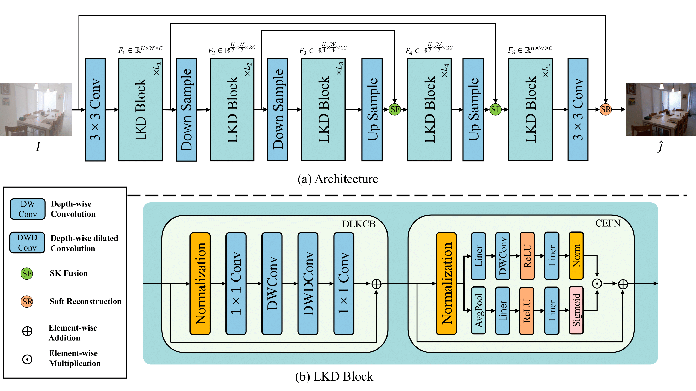

# [ICME 2023] LKD-Net: Large Kernel Convolution Network for Single Image Dehazing

>This is the official implementation of LKD-Net.

## Network Architecture


## Getting Started
### Installation

1. Clone our repository.
```
git clone https://github.com/SWU-CS-MediaLab/LKD-Net.git
cd LKD-Net
```

2. Make conda environment.
```
conda create -n LKD python=3.7.0
conda activate LKD
```

3. Install dependencies.
```
conda conda install pytorch==1.10.1 torchvision==0.11.2 torchaudio==0.10.1 cudatoolkit=10.2 -c pytorch
pip install -r requirement.txt
```

### Datasets Preparation

RESIDE official website [here](https://sites.google.com/view/reside-dehaze-datasets/reside-v0).

<details>
<summary> DATASETS FILE STRUCTURE </summary>

```
|-- data
    |-- ITS
        |-- hazy
            |-- *.png
        |-- gt
            |-- *.png
    |-- OTS 
        |-- hazy
            |-- *.jpg
        |-- gt
            |-- *.jpg
    |-- SOTS
        |-- indoor
            |-- hazy
                |-- *.png
            |-- gt
                |-- *.png
        |-- outdoor
            |-- hazy
                |-- *.jpg
            |-- gt
                |-- *.png
```
</details>

### Train
 Run the following script to train you own model.
 ```
 python train.py \
--model LKD-t \
--model_name LKD.py \
--num_workers 8 \
--save_dir ./result \
--datasets_dir ./data \
--train_dataset ITS \
--valid_dataset SOTS \
--exp_config indoor \
--gpu 0 \
--exp_name train_my_model \

 ```

### Test

Run the following script to test the trained mode.
```
python test.py --model (model name) --model_weight (model weight dir) --data_dir (your dataset dir) --save_dir (path to save test result) --dataset (dataset name) --subset (subset name)
```
For example, we test the LKD-t on the SOTS indoor set.
```
python test.py --model LKD-t --model_weight ./result/RESIDE-IN/LKD-t/LKD-t.pth --data_dir ./data --save_dir ./result --dataset SOTS --subset indoor
```

### Acknowledgement
Thanks for the work of [Yuda Song et al](https://ieeexplore.ieee.org/document/10076399/). Our code is heavily borrowed from the implementation of [Dehazeformer](https://github.com/IDKiro/DehazeFormer).